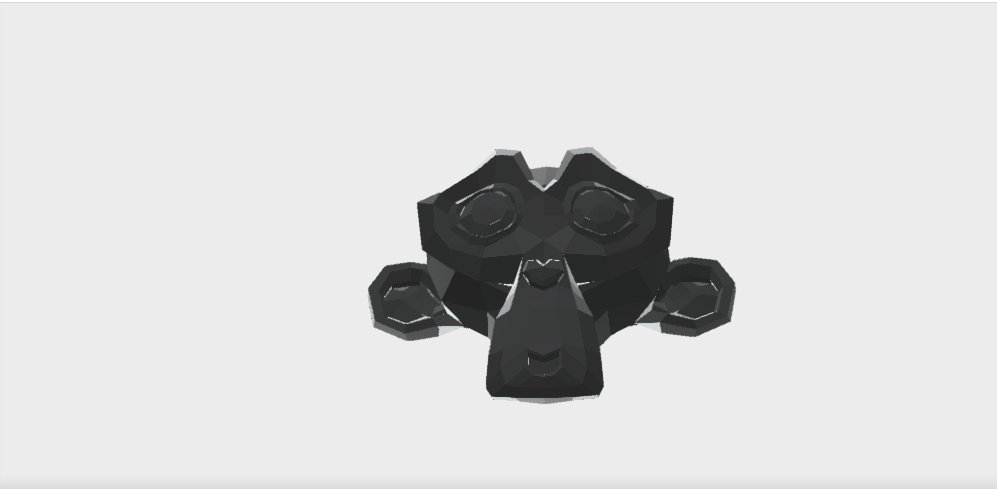
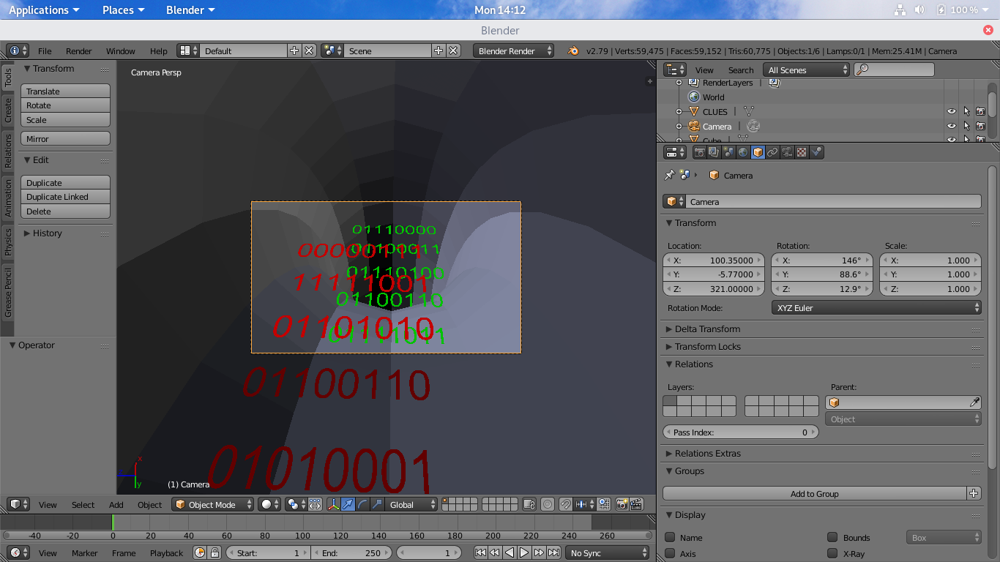

## INTO THE NEXT DIMENSION

https://ctf.pragyan.org/challenges?category=forensics

## Discription

Alice is stuck in a two-dimensional world and somehow needs to escape into reality, our three-dimensional world. In order to do so, she must crack a code hidden inside a file(named 'way_out.obj'). The only clues the two-dimensional Gods have given her is this:

clue_begin

0 - P(100, -5, 321), R(0, 90, 0) => pctf{
1 - P(-50, -33, 77), R(90, 0, 0)
2 - P(123, -5, 68), R(60, 30, 0)
3 - P(-89, 90, 0), R(34, 23, 32)
4 - P(-39, 40, 40), R(44, 55, 66)
P(111, 222, 333)
5-10 - Ears, eyes, nose and mouth
11 - Inside the key => 3}

You will never find a way out without colors.

clue_end

Help Alice get back to reality and hence find the flag. Good luck (Y).

[way_out.obj](https://ctf.pragyan.org/download?file_key=b93bf3fd8a7b9d7ca11d622b65e1be99555b65334f293ce462dafd32724e7812&team_key=5673f35469769414aeb9e22c9349f69db0112cddbb2bac9aeda9f95601f86c66)

## Solution

Directly opening the  way_out.obj with cat or something else, I found that it is not the normal .obj file that i recognized

```
EmissiveColorSColorSSAD�?DDSEmissiveFactorSNumberSSAmbientColorSColorSS
```

Google those names in this file. It should be a .fbx format, which is a  3D asset exchange format of autodesk.

There is many 3D online viewer that you can render these 3D objects on the Internet, and I chose [Autodesk Viewer](https://viewer.autodesk.com/).

After Observed the file you can see many objects in there.


and also, you can find out some binary numbers in the objects,and these should be the flag. 

Those P and R in the clue is the viewpoint of the camera to see the order of these numbers.

Wait... what is this



I found it is the icon of a 3D computer graphics program which is called 'blender', this might be a clue.

After downloading the software, it is much more easier to observe the number. You can set the location (P) and the rotation (R) of the camera, then set the active object as camera.

Decoding these binary, the green numbers seem to be the right one.



```
pctf{3d>2df0l1f3}
```

